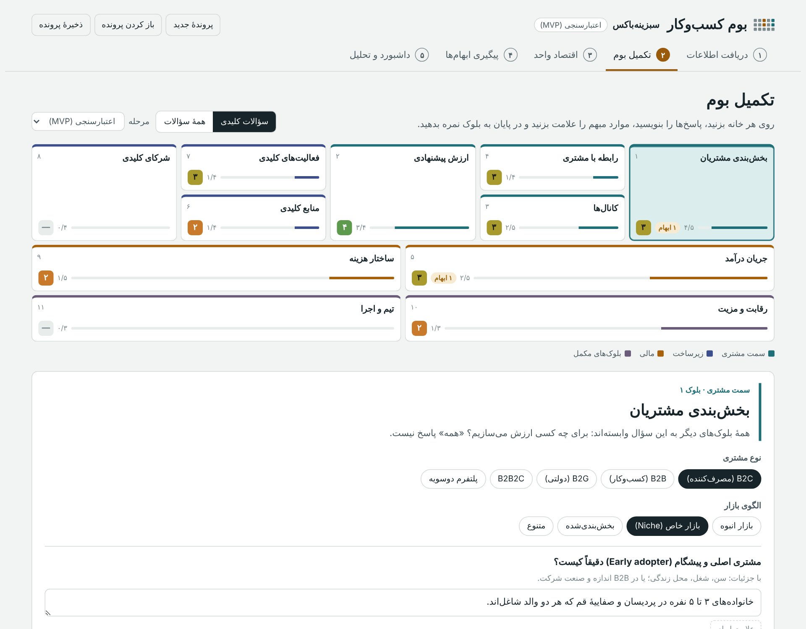
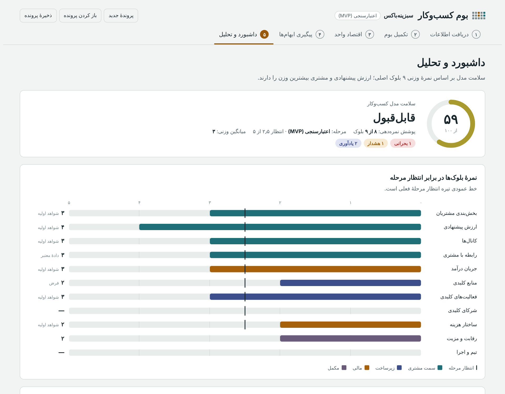

<div dir="rtl">

# بوم کسب‌وکار پیام

ابزاری فارسی و فرایندمحور برای تحلیل استارتاپ‌ها و کسب‌وکارها بر پایهٔ **بوم مدل کسب‌وکار** (Business Model Canvas). از دریافت اطلاعات بنیان‌گذار شروع می‌شود و به نمره‌دهی، کشف ناسازگاری‌ها، تحلیل هوش مصنوعی و گزارش نهایی می‌رسد.

**[نسخهٔ آنلاین](https://sedyasin.github.io/bmc-analyzer/)** · **[دانلود برای اجرای لوکال](https://github.com/SedYasin/bmc-analyzer/raw/main/index.html)**



## چرا

تمپلیت اکسلی اولیه ([`docs/original-template.xlsx`](docs/original-template.xlsx)) دو مشکل داشت:
- پر کردنش روی سیستم دردسر بود.
- سؤال‌هایش برای تحلیل عمیق کافی نبود.

این ابزار هر دو را حل می‌کند و روال کاری تحلیل‌گر را هم در خودش دارد:

دریافت اطلاعات ← پر کردن بوم ← علامت زدن ابهام‌ها ← پیگیری از بنیان‌گذار ← تحلیل

## فرایند کار

| مرحله | کاری که انجام می‌شود |
|:--|:--|
| **۱. دریافت اطلاعات** | ثبت مشخصات پرونده و مرحلهٔ کسب‌وکار، چسباندن یادداشت‌های خام بنیان‌گذار، و ساخت پیام درخواست اطلاعات پیش از جلسه |
| **۲. تکمیل بوم** | ۹ بلوک اصلی و ۲ بلوک مکمل با سؤال‌های غنی‌شده، گزینه‌های انتخابی، علامت ابهام و نمره‌دهی |
| **۳. اقتصاد واحد** | محاسبهٔ LTV، نسبت LTV به CAC، زمان برگشت هزینهٔ جذب، نقطهٔ سربه‌سر و مدت دوام نقدینگی (runway) |
| **۴. پیگیری ابهام‌ها** | جمع شدن همهٔ موارد مبهم در یک پیام آماده برای ارسال به بنیان‌گذار |
| **۵. داشبورد و تحلیل** | نمرهٔ سلامت مدل، هشدارهای ناسازگاری، تحلیل هوش مصنوعی و خروجی‌ها |



## امکانات

- **سؤال‌های مرحله‌محور:** ۷۷ سؤال در ۱۱ بلوک (۳۷ سؤال کلیدی)، به‌علاوهٔ ۳۶ سؤال مخصوص مرحله (ایده / اعتبارسنجی / کشش بازار / رشد). سؤال‌ها در دو حالت «کلیدی» و «کامل» نمایش داده می‌شوند.
- **دو بلوک مکمل:** «رقابت و مزیت» و «تیم و اجرا»؛ دو موضوعی که بوم کلاسیک نمی‌بیند.
- **نمره‌دهی با معیار:** نمرهٔ ۱ تا ۵ با معیار مشخص برای هر بلوک، به‌همراه سطح شواهد (فرض / شواهد اولیه / دادهٔ معتبر). نمره‌ها با انتظار همان مرحله مقایسه می‌شوند.
- **نمرهٔ سلامت وزنی:** ارزش پیشنهادی و بخش‌بندی مشتری بیشترین وزن را دارند.
- **موتور هشدار:** نمونه‌هایی از ناسازگاری‌هایی که خودکار پیدا می‌شوند:
  - مشتری سازمانی بدون کانال فروش مستقیم
  - وابستگی به یک پلتفرم بیرونی
  - هزینهٔ ارزی با قیمت‌گذاری ثابت
  - نمرهٔ بالا بر پایهٔ فرض
  - LTV کمتر از CAC، یا runway کمتر از ۶ ماه
- **هوش مصنوعی:**
  - پیش‌نویس بوم از روی یادداشت‌های خام (فقط فیلدهای خالی پر می‌شوند)
  - تحلیل نهایی شامل نقاط قوت و ضعف، ناسازگاری‌ها، ریسک‌ها، اقدامات اولویت‌دار، و نمرهٔ پیشنهادی برای مقایسه با نمرهٔ تحلیل‌گر
- **خروجی‌ها:** فایل اکسل راست‌به‌چپ، گزارش HTML قابل‌چاپ (در مرورگر با «چاپ» به PDF تبدیل می‌شود) و فایل پرونده (`.json`) برای ادامهٔ کار.

## شروع به کار

| روش | هوش مصنوعی | دانلود فایل‌ها |
|:--|:--|:--|
| [نسخهٔ آنلاین](https://sedyasin.github.io/bmc-analyzer/) | روش دستی | مستقیم با مرورگر |
| اجرای لوکال `index.html` | روش دستی | مستقیم با مرورگر |
| Artifact در Claude | خودکار، داخل برنامه | از طریق Claude |

**اجرای لوکال:** فایل [`index.html`](https://github.com/SedYasin/bmc-analyzer/raw/main/index.html) را دانلود کنید و در Chrome یا Edge باز کنید. نصب چیزی لازم نیست.

**روش دستی هوش مصنوعی:**
1. دکمهٔ «کپی پرامپت» را بزنید.
2. پرامپت را در یک گفتگوی Claude بچسبانید.
3. کل پاسخ Claude را در کادر برنامه بچسبانید و «اعمال پاسخ» را بزنید.

## حریم خصوصی

همهٔ اطلاعات فقط در مرورگر خودتان می‌ماند و به هیچ سروری ارسال نمی‌شود. پیش‌نویس در حافظهٔ همان مرورگر ذخیره می‌شود. برای جابه‌جا کردن کار بین دستگاه‌ها، از «ذخیرهٔ پرونده» و «باز کردن پرونده» استفاده کنید.

## سفارشی‌سازی

| چه چیزی | کجا |
|:--|:--|
| سؤال‌ها، گزینه‌ها و معیار نمره‌دهی | `src/data.js`، آرایهٔ `BLOCKS` |
| وزن هر بلوک در نمرهٔ سلامت | فیلد `weight` هر بلوک |
| انتظار نمره در هر مرحله | فیلد `exp` در آرایهٔ `STAGES` |
| قواعد هشدار و ناسازگاری | تابع `warnings()` در `src/app.js` |
| پرامپت‌های هوش مصنوعی | توابع `draftPrompt()` و `analysisPrompt()` در `src/app.js` |

هر سؤال به این شکل تعریف می‌شود: `[شناسه، متن سؤال، راهنما، کلیدی است؟ (۱ یا ۰)]`

بعد از هر تغییر، دو خروجی را دوباره بسازید:

```bash
python3 build.py
```

## ساختار پروژه

```
├── index.html         نسخهٔ مستقل؛ برای اجرای لوکال و GitHub Pages (ساخته‌شده)
├── artifact.html      نسخهٔ قابل‌انتشار در Claude (ساخته‌شده)
├── build.py           سرهم کردن فایل‌های src
├── src/
│   ├── page.html      ساختار صفحه و استایل‌ها
│   ├── data.js        بانک سؤالات و منطق تحلیلی
│   └── app.js         منطق برنامه، محاسبات، هوش مصنوعی و خروجی‌ها
└── docs/              تمپلیت اکسلی اولیه و تصاویر
```

برنامه بدون فریم‌ورک و در قالب یک فایل HTML نوشته شده است. فونت Vazirmatn و کتابخانهٔ SheetJS (برای خروجی اکسل) از اینترنت بارگذاری می‌شوند. بدون اینترنت هم برنامه کار می‌کند، فقط با فونت پیش‌فرض و بدون خروجی اکسل.

---

طراحی تمپلیت و روش تحلیل: **سید یاسین پیام**

</div>
